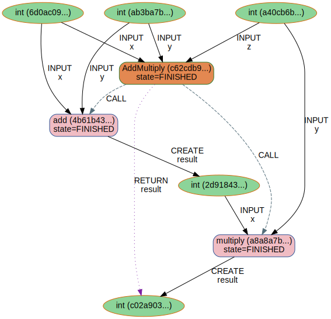

# NodeGraph
[](https://badge.fury.io/py/node-graph)
[](https://github.com/scinode/node-graph/actions/workflows/ci.yaml)
[](https://codecov.io/gh/scinode/node-graph)
[](http://node-graph.readthedocs.io/)


A platform for designing node-based workflows.


```console
    pip install --upgrade --user node_graph
```


## Documentation
Check the [docs](https://node-graph.readthedocs.io/en/latest/) and learn about the features.

## Examples
**A simple math calculation**

```python
from node_graph import NodeGraph, node

@node()
def add(x, y):
    return x + y

@node()
def multiply(x, y):
    return x * y

@node.graph()
def AddMultiply(x, y, z):
    the_sum = add(x=x, y=y).result
    return multiply(x=the_sum, y=z).result

```

## Engines and provenance
Run graphs directly in Python:

```python
from node_graph.engine.direct import DirectEngine

graph = AddMultiply.build(x=1, y=2, z=3)

engine = DirectEngine()
results = engine.run(graph)
# export provenance for visualization
engine.recorder.save_graphviz_svg("add_multiply.svg")
```


</div>

<p align="center">

</p>

## License
[MIT](http://opensource.org/licenses/MIT)
